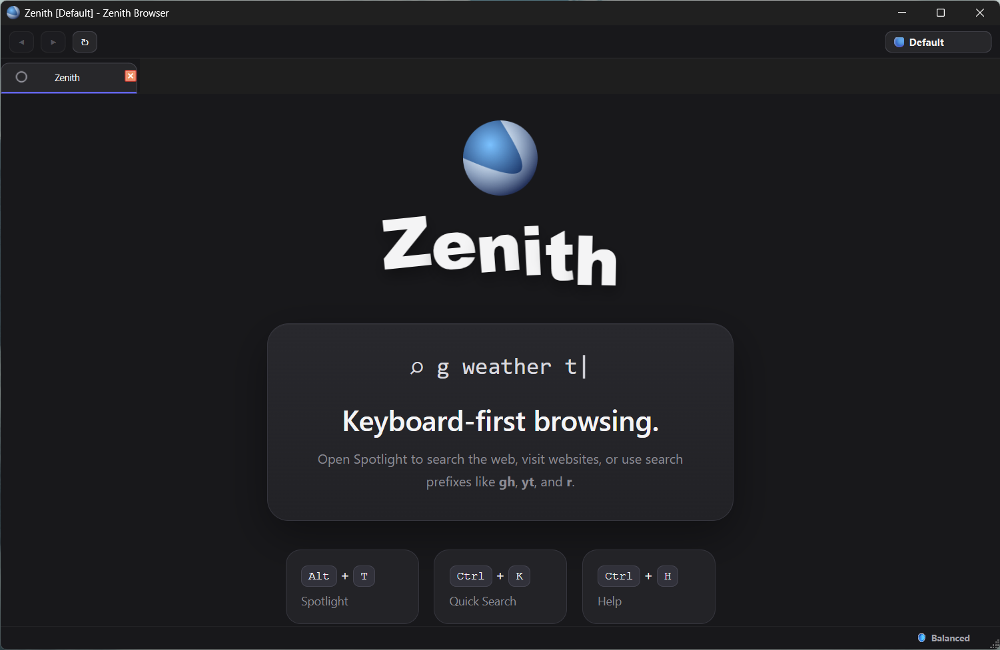

# ⚡ Zenith Browser

  <b>A keyboard-first browser built around speed, control, and simplicity.</b>

  No clutter. No forced UI. Just browse the web your way.

---

## 🌐 About Zenith

Zenith is a lightweight, keyboard-driven browser built with **PyQt6**.

Traditional browsers are built around the URL bar. Zenith takes a different approach: use the built-in **Spotlight** system to navigate, search, and control your browser without breaking your workflow.

Press a key. Type what you want. Go.

---

## ✨ Features

### ⚡ Spotlight Navigation

Zenith's central command system lets you instantly search or open websites.

Examples:

yt cats

→ Search YouTube for cats

gh pyqt6

→ Search GitHub for PyQt6 projects

→ Search Google for Python tutorials

Supported prefixes:

| Prefix | Service |
|--------|---------|
| `g` | Google |
| `d` | DuckDuckGo |
| `b` | Brave Search |
| `k` | Kagi |
| `gh` | GitHub |
| `yt` | YouTube |
| `r` | Reddit |

---

## ⌨️ Keyboard First

Zenith is designed to be used without constantly reaching for the mouse.

Popular shortcuts:

| Action | Shortcut |
|--------|----------|
| Open Spotlight | `Alt + T` |
| New Tab | `Ctrl + T` |
| Close Tab | `Ctrl + W` |
| Restore Tab | `Ctrl + Shift + T` |
| Switch Tabs | `Ctrl + Tab` |
| Switch Profiles | `Ctrl + Shift + P` |
| Settings | `Ctrl + ,` |

---

## 👤 Profiles

Keep separate browsing environments with Zenith profiles.

Each profile can have its own:
- browsing data
- settings
- preferences

Switch instantly with: CTRL + SHIFT + P

---

## 🧩 Built-in Extensions

Zenith includes modular built-in tools:

### 📺 YouTube Shorts Blocker
Removes Shorts distractions and redirects short content into normal viewing.

### 🌙 Dark Reader Lite
Applies dark styling to bright websites.

### 📖 Distraction-Free Reader Mode
Removes unnecessary page clutter for focused reading.

### 🧹 Storage Cleaner
Quickly clear browser data and storage.

---

## 🛡️ Privacy & Control

Zenith was built with one goal:

**Know what your browser is doing.**

No unnecessary features.
No forced accounts.
No extra clutter.

You choose how your browser works.

---

## 🛠️ Built With

- Python
- PyQt6
- QtWebEngine

---

No Python installation required.

---

## 🚧 Roadmap

Future ideas:

- [ ] Linux build
- [ ] Better extension API
- [ ] More Spotlight commands
- [ ] Custom themes
- [ ] Automatic updates

---

## 📸 Screenshots

---

  <b>Zenith — reach the web faster.</b>

